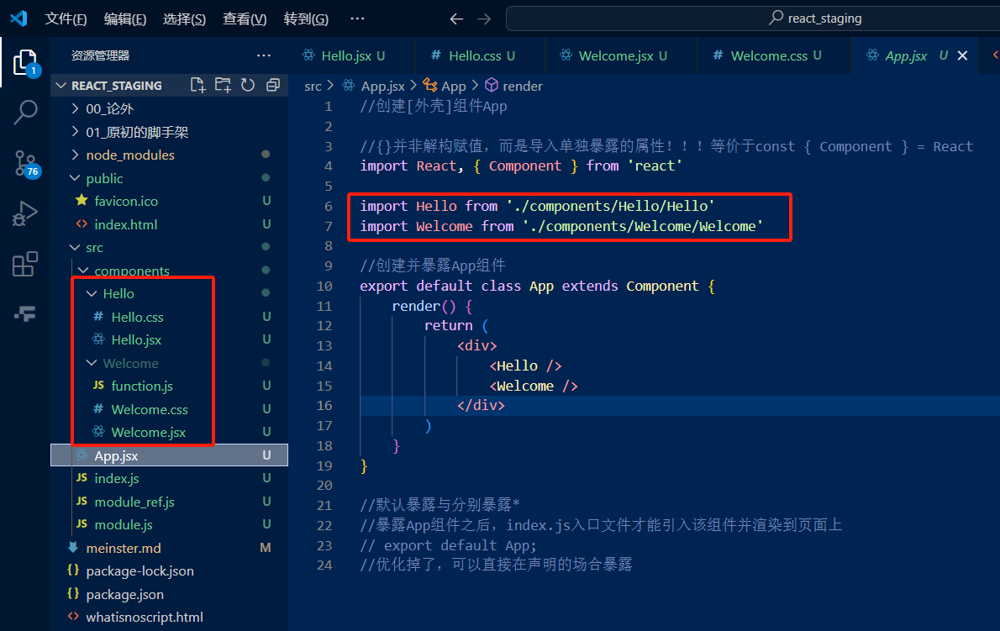

一、node_modules & public
node_modules存的依赖文件
public中存的基本都是静态资源文件
-favicon.ico 网站图标
-index.html 网站的主页文件 整个项目里面有且仅有一个html 多个功能就对应多个组件 SPA应用(single page application)
-manifest.json 应用加壳时的配置文件
-robots.txt 网站的爬虫协议文件(指定爬虫能够爬取页面的什么信息)

应用加壳，Android-java/IOS-OC|Swift 是不是非常麻烦，不同的环境需要学习不同的开发语言，
但是应用加壳可以在html的基础上加上不同生态系统的壳，就可以生成对应的apk或ipa
-manifest.json 就是配置了应用图标、名字、访问设备的权限(xxx想要yyy的权限)等信息

二、src
其中含有App.css与App.js文件，js组件、css样式文件；注意到在index.html中有root节点，其只会引入一个组件叫做App(因为一个节点会被后续render的组件覆盖，所以只引入一个组件)

App.test.js仅用于测试App组件，该js基本不用

index.css 通用型的样式文件，其甚至可以放到public下，新建一个css文件夹，然后其他文件主动链接到指定的.css文件即可

index.js 入口文件，其会引入App组件，并渲染到root节点上

reportWebVitals.js 用于性能记录

setUpTests.js 进行整体测试的框架的配置文件

三、第一个组件
因此需要进行编辑的文件也就三个
index.html  主页面
App.js      APP组件
index.js    入口文件

如果控制台有warning应该就是18版本，教程是17版本，降版本的话在终端运行 npm install react@17.x react-dom@17.x --save

//【组件】与【带有业务逻辑的js】不能都用js结尾，容易区分不开
// 有两种方法来增加辨识度：1、组件后缀改为jsx 2、组件的名称大写
其中App.js可以不改，它的优先级比较高

src/components/组件名/index.js+index.css

import 组件的时候 如果是js或者jsx就可以省略后缀名，而只需要写入组件名即可

这种情况下的引入有点麻烦，可以使用index来将引入路径变小
在各个组件文件夹下将主体.jsx命名为index.jsx，然后在引入中就不再需要声明两次组件名，index相关的jsx会被自动import

css模块化：
防止css中的样式被全局污染(命名重复)，可以使用css module；
将index.css文件改名为index.module.css，然后在jsx文件中引入 import style from './index.module.css';
此处引入之后将其内容作为对象存到了style对象中
那之后该组件的样式就能通过style对象来调度，而不会造成全局污染了

ES7+ React/Redux/React-Native snippets的扩展插件安装使用
rcc = react class component
rcf = react functional component

因为public内容相对固定，所以现在可以只独立存储src的内容

四、组件固定结构
public：index.html+favicon.ico
src:
-components(存放各个组件的文件夹)
 App.jsx
 index.js

 *(通用)功能界面的组件化编码流程
 1、拆分组件：拆分界面，抽取组件
 2、实现静态组件：使用组件实现静态页面效果  (先写好样式，不考虑动态的输入 交互等内容)
 3、实现动态组件：
  3.1动态显示初始化数据
   3.1.1数据类型
   3.1.2数据名称
   3.1.3保存在哪个组件？
  3.2交互(从绑定事件监听开始)

  结构与样式：
  推荐做法是首先将结构丢入到App.jsx中查看框架的合理度，那之后再导入样式，查看是否与原型图或者预期相近，最后再将功能的细节划分到各个组件中

  现在一个父组件中的两个兄弟组件通信需要使用消息订阅与发布，但是没有学习，于是曲线救国去控制父组件的state状态

  组件间通信：
  现在需要将Header的值传递给App，更新其todos从而使得List中的Item  得到更新
  子组件想要给父组件传值，需要父组件给子组件一个回调函数，然后在子组件的事件中调用该回调函数，将值传给父组件

  id使用uuid生成 或者 小号版本 nanoid
  npm i nanoid
  npm i uuid
  import {nanoid} from 'nanoid' 那之后每次使用nanoid都会给一个全球唯一的id

  p58
  逻辑：
  App中的state会给到List中使用，而Header需要将用户输入的值给到List中；
  由于目前尚未知晓子组件之间通信的方式，
  现在让父组件App传递回调函数到子组件Header中，Header使用回调函数更新App中的state，
  App状态更新就需要重新调用render，而List是App的子组件，所以List的render函数也会被调用

  p59
  20250122 关于鼠标移动与背景高亮的实践
  state = {mouse:false}
  handleMouse = (isEnter) => {
    return () => {
      //返回值不写成函数的话，打开页面时就会触发那些事件函数
      this.setState({mouse:isEnter})  
    }
  }
  框的高亮显示
  <li style={{backgroundColor:this.state.mouse?'#ddd':'#fff'}} 灰&白
  onMouseEnter={this.handleMouse(true)} onMouseLeave={this.handleMouse(false)}>
  删除按钮的显示
  <button style={{ display: mouse? 'block' : 'none' }}>删除</button>

  p60
  状态在哪里，操作状态的方法就在哪里
  哪怕触发函数的组件是孙组件，也要在对应的真实爷组件中声明回调函数，再自上而下逐级传递到孙组件

  p61
  npm i prop-types
  对传递的props进行类型检查，防止传入错误的类型
  import PropTypes from 'prop-types';
  static propTypes = {
    //限制{addTodo}为一个[必传]的[函数]
    addTodo: PropTypes.func.isRequired
  }

  p62
  如果不想使用柯里化或者高阶函数 可以在这里直接使用箭头函数，使得其直接返回一个函数 而不需要再在回调函数声明的时候再进行函数的返回
  函数的声明要避开关键字 如delete
  let x ={aa:1,bb:2} delete x.aa
  if(confirm('确认删除该条记录吗？')){
      this.props.deleteTodo(id)
  }

  p63 
  Footer组件
  reduce用于数组计数统计：条件统计、条件求和、筛选最值  
  defaultChecked只在页面第一次渲染的时候进行一次生效，那之后需要使用onChange来切换对应checkbox或者说其他组件的状态
  也就是说一般情况下都会使用checked来保证可以通过其他的状态决定来【被动】切换checkbox状态，但也要有不通过其他状态的场合下使用onChange来【直接】切换

  p64
  todoList案例相关知识点
  1.拆分组件、实现静态组件，注意:className、style的写法
  2.动态初始化列表，如何确定将数据放在哪个组件的state中？
  -某个组件使用：放在其自身的state中
  -某些组件使用：放在他们共同的父组件state中(官方称此操作为：状态提升)
  3.关于父子之间通信：
  -1.【父组件】给【子组件】传递数据：通过props传递
  -2.【子组件】给【父组件】传递数据：通过props传递，要求父组件给子组件提供一个函数(类似于重写继承)
  4.注意defaultChecked 和 checked 的区别，类似的还有：defaultValue、value
  5.状态在哪里，操作状态的方法就在哪里？

  五、react ajax
  1.前置说明
  1)React本身只关注于界面，并不包含发送ajax请求的代码
  2)前端应用需要通过ajax请求与后台进行交互(json数据)
  3)react应用中需求集成第三方ajax库(或自己封装) -> 自己封装的请学习【sgg:ajax请求课程】，一般情况下不会自己封装(耗时且不完善)<-造轮子
  
  2.常用的ajax请求库
  1)JQuery：比较重，如果需要另外引入，不建议；
  因为使用react就需要尽可能减少自己去操作dom，只需要改数据更新状态让react去转化为虚拟dom转化真实dom渲染在页面
  而JQuery就是专门操作dom的库，所以不建议使用
  2)axios：轻量级，功能丰富，使用起来也比较方便，推荐使用
  a.封装XmlHttpRequest请求对象的ajax
  b.promise风格
  c.可以用在浏览器端和node服务器端

  npm i axios
  node server1.js

  3.跨域问题
  跨域问题 localhost3000(client)与5000(server)的通信
  产生跨域本质问题是ajax引擎把响应拦截了，而中间的代理服务器(端口与client一致)是通过请求转发(没有ajax引擎，同源策略不会限制它)，获取到值之后再给到client

  4.react中的代理模式
  4.1配置代理解决跨域
  package.json中配置proxy字段：
  "proxy": "http://localhost:5000"
在client端通过axios请求http://localhost:3000/api/xxx，会去先检索本机/api/xxx是否存在，不存在则会请求http://localhost:5000/api/xxxserver端的接口
但是这样比较死板，想一下微服务这种情况，似乎不够灵活

// ,"proxy": "http://localhost:5000" 现在会报错：
  npm start

> react_staging@0.1.0 start
> react-scripts start

Invalid options object. Dev Server has been initialized using an options object that does not match the API schema.
 - options.allowedHosts[0] should be a non-empty string.

//换成这个又不生效
 ,
  "options": {
    "allowedHosts":["localhost",".localhost"],
    "proxy":"http://localhost:5000"
  }

p66
多个网络配置proxy 代理就不太行了
在src中新建一个setupProxy.js文件(名称不可修改)，不可以用ES6的语法，只能用CJS(commonjs)的语法，其并非给前端代码执行，react脚手架会找到该文件并将其加到webpack的配置中，webpack中都是node的语法->都是CJS的语法

在src/setupProxy.js中写入以下内容：
//ES6语法import，CJS语法为require
const { createProxyMiddleware } = require('http-proxy-middleware');// 按住ctrl这个东西变蓝，是因为这个'http代理中间件'在脚手架初始化的时候就被引入了
module.exports = function(app) {
    //app.use可以传多个入参
    app.use(
        // 使用 createProxyMiddleware 创建代理中间件
        createProxyMiddleware('/api1', {//遇见'/api1'前缀的请求，就会触发该代理配置
            target: 'http://localhost:5000', //转发的目标地址
            changeOrigin: true, //控制服务器收到的请求头中HOST字段的值，如果不设置服务器得到的host是localhost:3000，加了变为5000，有时候对方服务器对host有限制时，最好设置为true，所以一般情况下都设置为true
            pathRewrite: { '/api1': '' }  //重写请求路径，将/api1替换成空字符串，使得访问的路径从【标识+访问路径】变成【访问路径】
        }),
        createProxyMiddleware('/api2', {
            target: 'http://localhost:5001',
            changeOrigin: true,
            pathRewrite: { '/api2': '' }
        })
    );
};

p67
成型的样式库最好放到public/css中;并在index.html中引入<link rel="stylesheet" href="./css/bootstrap.css">
组件拆分的时候，如果对css进行组件拆分，则需要对审查元素进行查看来分解样式

p68
axios访问中间层服务器:5000->githubAPI
多层解构赋值详解

p69
将Search查询到的数据交予List组件，List组件将数据渲染到页面上

//Warning: Each child in a list should have a unique "key" prop.
//要在【map遍历的最外侧的结构上】加上key属性，一般使用id比较好

p70
优化用户体验:
List组件的显示内容分为三种:{
  1、Search查询并通过App传递给List组件的用户信息
  2、没有开始查询的欢迎界面
  3、查询中的加载中提示界面

  4、error状态下的错误提示界面
}
jsx中的if-else:三元表示式嵌套

p71 消息订阅与发布机制
兄弟组件之间的交互

|Publish-Subscribe-JS库|https://github.com/mroderick/PubSubJS
1、pubsub-js库的下载
npm i pubsub-js --save
2、pubhub-js库的使用
1)引入
import PubSub from 'pubsub-js';
2)订阅
PubSub.subscribe('msg', function(msg, data){});
3)发布消息
PubSub.publish('msg', 'hello world');

4)原则
在需要接受数据的组件(接受方、订阅方)里订阅消息，在发送数据的组件(发布方)里发布消息

    //即将挂载时订阅
    componentDidMount() {
        //可以使用下划线占位，因为msg实际上已经传递了，(_, data)
        this.token = PubSub.subscribe('github user info',(msg,stataObj)=>{
            this.setState(stataObj)
        })
    }

    //组件将要卸载时取消订阅
    componentWillUnmount() {
        PubSub.unsubscribe(this.token)
    }

p72
ajax请求的发送
xhr(XMLHttpRequest)-jQuery(封装度高，但是回调地狱)
                   -axios(promise风格，解决回调地狱)
                   但实际上这两者都是对xhr的封装(服务器端没有xhr，所以服务器端的axios不是对xhr的封装而是http)

fetch promise风格，不需要xhr也能发送ajax请求，而且是内置的不需要下载安装
文档:
https://github.github.io/fetch/   挂了404
https://segmentfault.com/a/1190000003810652

关注分离的思想，访问服务器之后会提示链接服务器成功了，即使这个url地址在服务器中对应的接口是不存在的(404)，也会提示"链接"这个动作成功(只到服务器)
只有出现类似于"断网"的情况，让服务器与浏览器无法正常连通的情况下，才会出现error提示报错

response.json() 返回 Promise实例 {<pending>} 该实例的状态会在链接服务器成功的前提下，再根据是否正常获取到数据来决定
要进一步获取 返回的值 或者 失败的原因 需要使用 .then()
.then 能够链式调用的一个原因就是其返回值也可以是一个Promise实例对象从而再次被.then使用
如果上一级返回不是一个promise实例，那么状态就默认为成功，值就为非promise值
如果是一个promise实例，则状态和值都与其一致，将作为下一个.then的promise入参进行使用，如抛出一个异常，则状态就为异常 且 值为错误的原因

//如果失败error的回调输出一行字，那么下面的.then不会进到error中，因为会返回undefined(非promise值)状态为成功 其会进入到response路线中，因此需要return new Promise(()=>{}) 返回一个初始化状态的promise实例让后面的then进入到error分支中

    //用户搜索(使用fetch)
    searchUser = () => {
        //1.获取用户的输入
        const { inputSth: { value: keyword } } = this
        //1.2 发送请求前通知List更新state
        PubSub.publish('github user info', { isFirst: false, isLoading: true, error: null })
        //2.发送网络请求
        fetch(`/api1/search/users2?q=${keyword}`).then(
            response => {
                //404也算联系成功，只要是有响应都算链接成功
                console.log('链接服务器成功',response)
                //通知List更新state
                //PubSub.publish('github user info', { isFirst: false, isLoading: false, users: response.data.items })
                //如果链接到服务器成功，则调用json方法
                return response.json()
            },
            error => {
                console.log('链接服务器失败',error)//如果失败的回调输出一行字，那么下面的then不会进到error中，因为会返回undefined(非promise值)状态为成功
                //手工中断
                return new Promise(()=>{})
                //通知List更新state
                // PubSub.publish('github user info', { isFirst: false, isLoading: false, error: error.message })
            }
        ).then(
            //.then 能够链式调用的一个原因就是其返回值也可以是一个Promise实例对象从而再次被.then使用
            //如果上一级返回不是一个promise实例，那么状态就默认为成功，值就为非promise值
            //如果是一个promise实例，则状态和值都与其一致，将作为下一个.then的promise入参进行使用，如抛出一个异常，则状态就为异常 且 值为错误的原因
            response => {
                console.log("获取数据成功", response)
            },
            error => {
                console.log("获取数据失败", error)
            }
        )
    }

注意到上述的写法中fetch().then().then() error的处理每个层级都有，非常的冗余，可以在最后使用catch进行错误的统一处理

优化：
1、统一catch处理错误
2、链式调用简化 -> 使用async/await简化代码
3、使用try-catch处理错误

fetch使用频率一般，因为一些老浏览器不兼容fetch

总结：
1、fetch：原生函数，不再使用XMLHttpRequest对象提交ajax请求
2、老版本浏览器可能不支持fetch
3、在fecth之前想要发送ajax请求，只能使用XMLHttpRequest(XHR)对象，但是现在ajax请求可以使用 Fetch/XHR

p73 github搜索案例总结
1.设计状态时要考虑全面，例如带有网络请求的组件，要考虑请求失败怎么办
2.ES6小知识点：解构赋值+重命名
    let obj = {a:{b:1}};
    // 1. 传统解构赋值
    const {a} = obj; 
    // 等效于 const a = obj.a;
    // 结果：a = {b:1}
    // 2. 连续解构赋值
    const {a: {b}} = obj;
    // 等效于 const b = obj.a.b;
    // 结果：b = 1（不会创建变量 a）
    // 3. 连续解构+重命名
    const {a: {b: value}} = obj;
    // 等效于 const value = obj.a.b;
    // 结果：value = 1（不会创建变量 a 和 b）

3.消息订阅与发布机制
 0.引入pubsub-js库
    import PubSub from 'pubsub-js'
    //即将挂载时订阅
    componentDidMount() {
        //可以使用下划线占位，因为msg实际上已经传递了，(_, data)
        this.token = PubSub.subscribe('keyWord',(msg, stataObj)=>{
            this.setState(stataObj)
        })
    }
    //组件将要卸载时取消订阅
    componentWillUnmount() {
        PubSub.unsubscribe(this.token)
    }

 1.先订阅，再发布（理解：有一种隔空对话的感觉，其实就是消息队列的一种）
 2.适用于任意组件之间通信
 3.要在组件的componentWillUnmount中取消订阅

4.fetch发送请求（关注分离的设计思想）
        try
        //使用await的时候 要在函数前加上async关键字
        {   //await只会等到成功的结果，遇到错误会忽略 因此需要使用try...catch
            const response = await fetch(`/api1/search/users2?q=${keyword}`)
            //获取Promise中的value结果
            const result = await response.json()
            console.log("本次请求返回的结果为: ",result)
            PubSub.publish('github user info', { isFirst: false, isLoading: false, users: result.items })
        }
        catch(error){
            console.log("!什么东西出错了!!", error)
            PubSub.publish('github user info', { isFirst: false, isLoading: false, error: error.message })
        }

五、React路由
p74 SPA的理解
1.SPA的理解：
1.1 单页Web应用(single page web application, SPA)
1.2 整个应用只有一个完整的页面
1.3 点击页面中的链接不会刷新页面，只会做页面的局部刷新
1.4 数据都需要通过ajax请求获取，并在前端异步展现

开发的spa应用是单页面多组件

p75 对路由的理解
路由：映射关系 key-value (key为路径，value可能是function或component)
前端路由工作原理：
点击导航栏区域变更浏览器中的url后半部分路径，有监测到url后半部分变化的路由组件，匹配到对应的组件，负责渲染组件到指定的展示区域，实现页面的局部刷新

路由分类：
1、后端路由：
1.1 value是function，用来处理客户端提交的请求
1.2 注册路由：router.get(path,function(req,res))
1.3 工作过程：当node接收到一个请求时，根据请求路径找到匹配的路由，调用路由中的函数来处理请求，返回响应数据

2、前端路由：
2.1 value是component，用于展示页面内容
2.2 注册路由：<Route path="/path" component={Sth}>
2.3 工作过程：当浏览器的path变为/path时，当前路由组件就会变为Sth组件

p76 前端路由原理
前端路由靠浏览器的历史记录(history)

DOM 文档对象模型
BOM 浏览器对象模型 <- history在这里 <- window就是BOM，window.history就是history对象
由于原生的api操作BOM非常麻烦，可以使用history.js

前端路由的基石_history.html 中有演示
BOM是一个栈的结构，push是追加历史记录，而replace是替换当前历史记录
所以后退是出栈pop，前进是入栈只不过这里会把之前pop的记录存下来

锚点跳转 hash路由 ：
# + 不刷新页面但产生历史记录

react-router 5的理解
p77 路由的基本使用

三种实现给到不同的三个平台去使用：
web    网页开发使用
native react原生应用开发使用
anywhere 任何地方

react-router-dom@5的使用
//20250214 npm install react-router-dom 默认安装是6版本
//先学习使用 npm i react-router-dom@5 默认为5版本
1.react的一个插件库
2.专门用来实现一个SPA应用
3.基于react的项目基本都会用到此库

库的卸载安装
npm uninstall react-router react-router-dom  卸载现有的库
npm install react-router-dom@5 安装指定版本的库

想要写好一个SPA(单页面'多组件'应用)，先找到导航区和展示区
点击导航区->变更url路径->前端路由器检测到并匹配到对应的组件->渲染组件到展示区

步骤：
编写路由链接、注册路由
{
    错误1：
        Link标签的外侧需要有Router标签管理(路由器)
    错误2：
        不同的Router之间通信存在问题，最好是直接将其包括在App组件外侧，即index.js中使用Router
}

p78 路由组件与一般组件
1、明确好界面中的导航区、展示区
2、导航区的a标签改为Link标签 <Link to="/xxxx">xxxx的提示语</Link>
3、展示区使用Route标签进行路径的匹配 <Route path="/xxxx" component={Demo}>
4、<App>的最外侧包裹一个<BrowserRouter>或者<HashRouter>来使得路由通信生效

BrowserRouter 基于HTML5的history API，可以实现前进、后退、刷新操作                                                      /about
HashRouter 基于hash(#)的url，可以实现无刷新跳转，#号后面的内(被认定为hash值、锚点值，被认定为是前台资源)都不会发送到服务器  /#/about

虽然About与Home都为组件放在了components文件夹下，但是他们都是路由组件，因此需要更改其存放位置到pages文件夹
路由组件:<Route path="/home" component={Home}/> 依靠路由匹配来展示对应组件
一般组件:<Home /> 直接使用该组件

而这两者最大的区别是：一般组件的props如果不主动传递值是不会有所接收的
而路由组件则会接收到路由器所传递的几个重要的props信息:history、location、match等props

路由组件与一般组件的区别总结:
1、写法不同：
    一般组件：<Demo/>
    路由组件；<Route path="/demo" component={Demo}/>
2、存放位置不同：
    一般组件：components文件夹下
    路由组件：pages文件夹下
3、接收props的不同：
    一般组件：写组件标签的时候，传递什么props，就能接收到什么props
    路由组件：接收到路由器传递的三个固定props属性：history、location、match

路由组件的props示例:
{
    history:
        action: "PUSH"
        block: function block(prompt)​​
        createHref: function createHref(location)​​
        go: function go(n)​​
        goBack: function goBack()​​
        goForward: function goForward()
        length: 6
        listen: function listen(listener)​​
        location: Object { pathname: "/about", search: "", key: "dojpfn", … }
        push: function push(path, state)​​
        replace: function replace(path, state)​​
    location: 
        hash: ""
        key: "dojpfn"
        pathname: "/about"
        search: ""
        state: undefined
    match:
        isExact: true
        params: Object {  }
        path: "/about"
        url: "/about"
    staticContext: undefined
}
注意到history.location 和 location 这两个数据是一样的
location中的key每次刷新都不一样(随机生成的)
match中的isExact表示是否完全匹配，如果是false，则匹配的是子路由
再去掉一些平时不关注的属性，那么现在将上述的props化简为：
{
    history:
        go: function go(n)​​
        goBack: function goBack()​​
        goForward: function goForward()
        push: function push(path, state)​​
        replace: function replace(path, state)​​
    location: 
        pathname: "/about"
        search: ""
        state: undefined
    match:
        params: Object {}
        path: "/about"
        url: "/about"
}

p79 NavLink的使用
bootstrap在public中已经引入，其作为一个广泛使用的前端开发框架被默认引入
想要实现默认的高亮效果：
默认
<Link className="list-group-item" to="/home">Home</Link>
点击后，希望其变为高亮状态
<Link className="list-group-item active" to="/home">Home</Link>
可以使用NavLink，其默认的作用就是在点击后在样式后拼接一个active
<NavLink className="list-group-item" to="/home">Home</NavLink>
当然为了其灵活性，也可以增加其他的属性，比如activeClassName，activeStyle等来保证变换为想要的格式
<NavLink activeClassName="chenhs" className="list-group-item" to="/home">Home</NavLink>

在/public/index.html中写一个自定义的style
    
那之后css切换正确且流畅

p80 封装NavLink组件
试想一下：
<NavLink activeClassName="chenhs" className="list-group-item" to="/home">Home</NavLink>
如果我有很多个类似的导航，那么这段代码会重复无数次
<NavLink activeClassName="chenhs" className="list-group-item" to="/home1">Home1</NavLink>
<NavLink activeClassName="chenhs" className="list-group-item" to="/home2">Home2</NavLink>
<NavLink activeClassName="chenhs" className="list-group-item" to="/home3">Home3</NavLink>
<NavLink activeClassName="chenhs" className="list-group-item" to="/home4">Home4</NavLink>
<NavLink activeClassName="chenhs" className="list-group-item" to="/home5">Home5</NavLink>
activeClassName className 这两部分是保持不变的，只有to和提示词在变换，因此可以对其进行一定的封装，使得代码的复用率提高
<MyNavLink to="/home">Home</MyNavLink>
之所以叫做封装而不是叫做重构，就是因为要在MyNavLink中引入并使用NavLink，进行部分改造作为自己的NavLink
传入的多个props属性，可以使用{...this.props}来进行展开赋值
但 <组件名 标签属性="xyz">标签体</组件名>中标签体需要额外使用props来传递就非常的不合理，如<A {...this.props}>{this.props.title}</A>
注意到标签体内容也是一个特殊的标签属性，只不过它在props中的key叫做children，因此可以直接使用{this.props.children}来获取
即 <A {...this.props}>{this.props.children}</A>
同理标签体也可以不写在两个标签开闭中，可以直接作为props属性的children传入
<ComponentName 固定属性名1="指定属性值1" 固定属性名2="指定属性值2" ... {...this.props} />

小结：
1、NavLink可以实现路由链接的高亮，通过activeClassName指定样式名
2、标签体内容是一个特殊的标签属性
3、this.props.children可以获取标签体内容
4、{...this.props}可以展开props属性并赋值到对应的项上

p81 Switch的使用
正常情况下，一个路由对应一个组件
<Route path="/about" component={About} />
<Route path="/home" component={Home} />
<Route path="/home" component={Test} />
但如果是这种情况，访问/home路径时，会渲染Home与Test组件(但是一般情况下，想要访问多个组件最好将其合并到一个组件中作为终端)
但是正常情况下，一个路由对应一个组件，我们希望一旦匹配成功，就不再继续执行匹配(提高效率)
可以使用Switch来实现，只需要将定义的Route包在其中，就可以初次匹配就break，从而提高效率
<Switch>
    <Route path="/about" component={About} />
    <Route path="/home" component={Home} />
    <Route path="/home" component={Test} />
</Switch>

小结：
1、通常情况下，path和component是一一对应的
2、单一匹配原则:Switch可以提高路由匹配的效率，只要匹配到第一个就不再继续匹配

p82 解决样式丢失问题
将路径从/home改为/duan55/home后，刷新页面，样式丢失 详见附件./assets/05_bootstrap样式丢失了吗.png

解析：
注意到其访问的路径为http://localhost:3000/duan55/css/bootstrap.css
localhost:3000是脚手架内置的服务器，通过webpack-dev-server启动的，即localhost:3000就是脚手架
而react脚手架中通过webpack中的配置，将public文件夹作为localhost:3000这台内置服务器的根路径
如果请求了一个不存在的资源，则会返回/public/index.html

之前没有变换访问路径的时候访问的是http://localhost:3000/css/bootstrap.css
变换之后访问的路径是http://localhost:3000/duan55/css/bootstrap.css
相当于去访问/public/duan55/css/bootstrap.css，而这个路径不存在，因此返回的是默认的index.html

所以其样式丢失的真实原因在请求bootstrap.css的时候返回了没有找到该路径资源时的默认返回兜底返回值的index.html

原因：
路由变为多级结构时，刷新页面导致css文件寻址错误，进而导致样式丢失

解决办法：
1、将/public/index.html中的样式引入方式从相对路径修改为绝对路径
<link rel="stylesheet" href="./css/bootstrap.css"> --> <link rel="stylesheet" href="/css/bootstrap.css">
这样在寻址错误默认返回index.html时，
样式从localhost:3000/duan55/css/bootstrap.css中加载变为每次都加载绝对路径的的localhost:3000/public/css/bootstrap.css

2、<link rel="stylesheet" href="./css/bootstrap.css"> --> <link rel="stylesheet" href="%PUBLIC_URL%/css/bootstrap.css">
%PUBLIC_URL%表示public文件夹的绝对路径，与第一种方法类似，也是将路径引导至正确的css文件位置

3、将BrowserRouter改为HashRouter
路径中增加了#，其后面的路径都被认定为前端资源，压根不会发往后端，即避免了路径寻址错误的问题
即localhost:3000#/duan55/home 向后端请求css的时候 #后面的内容被忽略 会请求localhost:3000/css/bootstrap.css 而不是/duan55/css/bootstrap.css

冷知识：
304表示访问缓存，使用强制刷新可以忽略缓存，重新请求资源，此时如果成功应该返回200

目前比较推荐第一种，因为美团也没有使用第三种方式，HashRouter的使用场景比较少

小结：
1、public/index.html中引入样式时不写 ./ 写 /
2、public/index.html中引入样式时不写 ./ 写 %PUBLIC_URL%  (仅适用于React的脚手架中)
3、使用HashRouter

p83 路由的模糊匹配与严格匹配
冷知识：
npm i 与 yarn add 不要混用，容易造成包丢失

模糊匹配：
下面这种情况是无法匹配的
<MyNavLink to="/home"> Home </MyNavLink>
<Route path="/home/a/b/c" component={Home} />

下面这种情况为模糊匹配，可以正常显示Home组件(符合最左前缀)
<MyNavLink to="/home/a/b/c"> Home </MyNavLink>
<Route path="/home" component={Home} />

精准匹配(严格匹配)：
需要在Route中增加属性 exact={true} 或 exact ，则会开启严格匹配，必须保证提供的路径与路由完全匹配才会渲染对应的组件

但是严格匹配不推荐默认开启，当且仅当页面中的渲染显示出现问题的场合再开启

小结：
1、默认使用的是模糊匹配：输入的路径对于路由要匹配的路径必须符合【最左】前缀的包含关系
2、开启严格匹配：<Route path="/home" exact component={Home} />
3、严格匹配不要随便开启，必须在模糊匹配影响到了页面显示的场合再开启，有的时候开启会导致无法继续匹配二级路由

p84 Redirect的使用
进入到网页的时候希望默认勾选一个组件进行显示，借助Redirect实现

在Switch的注册路由中，如果所有的路由都没有匹配到，则会渲染Redirect组件，将其跳转到指定的路由
<Switch>
    <Route path="/home" component={Home} />
    <Route path="/about" component={About} />
    {/*兜底作用，如果过上述都为进行匹配则听由Redirect发配到/home*/}
    <Redirect to="/home"/>
</Switch>

和java中的try-catch一样，Redirect可以捕获到路由匹配失败的情况，并将控制权转移到指定的路由

嵌套路由
p85 嵌套路由的使用
如果在二级路由匹配的前一级路由开启了严格匹配，那么进入/home中有news与message两个路由项，
选择任一后因为路由会去匹配最先注册的，即/home与/about路由层，
因为严格匹配后/home/news中不符合这两者，走重定向到/about，
会发现永远不会匹配到/home/message，因为/home/message已经被重定向

其他步骤同一级路由一样

小结：
1、注册子路由的时候需要加上父路由的path值
2、路由的匹配是按照注册路由的顺序进行的，如果有严格匹配的路由，则会影响到后续的匹配

p86 向路由组件传递params参数
如果展示区是当前组件，则导航区是展示区的父组件，即当前组件的父组件

向路由组件传递params参数
<Link to={`/home/message/detail/${item.id}/${item.title}`}>{item.title}</Link>
声明接收params参数，被传入到了match对象中params属性里，使用:xxx来接收
<Route path="/home/message/detail/:id/:title" component={Detail} />

组件中处理得到对应id的属性
const {targetId,targetTitle} = this.props.match.params
const findResult = data.find((item)=>{
     return item.id === targetId
})

小结：
1、路由链接（携带参数）：<Link to='/path1/path2/params1/params2'>详情</Link>  模板字符串方式
可以使用模板字符串进行传参：<Link to={`/home/message/detail/${item.id}/${item.title}`}>{item.title}</Link>
2、注册路由（声明接收）：<Route path='/path1/path2/:params1/:params2' component={Receiver}/>
3、接收参数：const {params1,params2} = this.props.match.params

p87 向路由组件传递search参数 （传递的时候比params简单，但是接收更加麻烦）
传入search参数只需要在路由链接中使用?a=1&b=2的形式即可，注册路由正常声明即可，但是，
接收search参数被传入到了location对象中的search属性中（但是其形式非常抽象: '?id=1&title=cry1'）
使用react脚手架自动安装的库 -> import qs from'qs' ((旧版本)import qs from 'query-string')

冷知识：urlencoded编码方式
let obj = { a: 1, b: 2 } -> a=1&b=2 
对象转化为key=value&key=value的形式，叫做urlencoded编码方式 

let obj = { song: 'chunriying', band: 'mygo' }
console.log(qs.stringify(obj)) // "song=春日影&band=mygo"
console.log(qs.parse(qs.stringify(obj))) //Object { song: "chunriying", band: "mygo" }
使用方式 
qs.stringify(obj) 将对象转化为urlencoded编码的字符串 
qs.parse(str) 将urlencoded编码的字符串转化为对象 

const {search} = this.props.location
const {id, title} = qs.parse(search.slice(1)) //去掉?号,然后使用qs.parse转化为对象

小结：
1、路由链接（携带参数）：<Link to='/path1/path2?params=2233&params2=abcd'>详情</Link>  模板字符串方式
2、注册路由（无需额外声明接收）：<Route path='/path1/path2' component={Receiver}/>
3、接收参数：
①const {search} = this.props.location //接收search参数，其形式为'?params=2233&params2=abcd'
②因为search是urlencoded编码字符串，需要借助querystring解析，qs.parse(search.slice(1)) //去掉?号,然后使用qs.parse转化为对象

p88 向路由组件传递state参数  （注意该state并非react中组件的state属性，而是路由组件上的独有属性）
前两种传递参数的方式都会在浏览器地址栏中显示传递的参数信息，而state参数会在浏览器地址栏中隐藏所传递的参数

在使用BrowerRouter的情况下，BrowserRouter一直在操作history对象，调用它的api，因此三种参数传递在刷新页面的情况下，都不会影响页面的显示
(前两中url地址有参数记录保留，state有history对象留存记录<history中有location，location中有state>)

小结：
1、路由链接（携带参数）：<Link to={{pathname:'/path1/path2',state:{params:2233,params2:'abcd'}}}>详情</Link>
2、注册路由（无需额外声明接收）：<Route path='/path1/path2' component={Receiver}/>
3、接收参数：const {params,params2} = this.props.location.state //接收state参数，其形式为{params:2233,params2:'abcd'}
ps：刷新后，因为BrowserRouter一直在操作history对象，调用它的api，因此state参数在刷新页面的情况下，都不会影响页面的显示

p89 路由参数的总结

params参数：
1、路由链接（携带参数）：<Link to='/path1/path2/params1/params2'>详情</Link>  模板字符串方式
可以使用模板字符串进行传参：<Link to={`/home/message/detail/${item.id}/${item.title}`}>{item.title}</Link>
2、注册路由（声明接收）：<Route path='/path1/path2/:params1/:params2' component={Receiver}/>
3、接收参数：const {params1,params2} = this.props.match.params

search参数：
1、路由链接（携带参数）：<Link to='/path1/path2?params=2233&params2=abcd'>详情</Link>  模板字符串方式
2、注册路由（无需额外声明接收）：<Route path='/path1/path2' component={Receiver}/>
3、接收参数：
①const {search} = this.props.location //接收search参数，其形式为'?params=2233&params2=abcd'
②因为search是urlencoded编码字符串，需要借助querystring解析，qs.parse(search.slice(1)) //去掉?号,然后使用qs.parse转化为对象

state参数：
1、路由链接（携带参数）：<Link to={{pathname:'/path1/path2',state:{params:2233,params2:'abcd'}}}>详情</Link>
2、注册路由（无需额外声明接收）：<Route path='/path1/path2' component={Receiver}/>
3、接收参数：const {params,params2} = this.props.location.state //接收state参数，其形式为{params:2233,params2:'abcd'}
ps：刷新后，因为BrowserRouter一直在操作history对象，调用它的api，因此state参数在刷新页面的情况下，都不会影响页面的显示

params比较泛用 频率最高；其次是search(解析起来麻烦)；state在不想要用户知道传递了什么参数或者参数的场合使用

注意到params传递path的场合也可以使用对象的形式(像state一样)，但是没有必要，基本上只有在传递state参数的场合才使用对象形式
例子：
<Link to={`/home/message/detail/${item.id}/${item.title}`}>{item.title}</Link>
<Link to={{pathname:`/home/message/detail/${item.id}/${item.title}`}}>{item.title}</Link>

路由跳转的两种方式
p90 push与replace（默认为push）

push 栈

replace 替换 
在Link中将replace设置为true，跳转则会替换掉当前的路由，而不是在栈中添加新的路由
<Link replace={true} to={{pathname: '/home/message/detail', state:{id:item.id,title:item.title}}}>{item.title}</Link>
注意到只有加上了replace的路由才会满足直接替换当前路由的条件，否则还是会在栈中添加新的路由，测试的时候要注意

p91 编程式路由导航
之前的路由跳转，需要使用Link及其衍生组件，点击实现跳转，那么如果是一张图片呢？
如果说将图片作为对象放到Link中还能实现，那么如果需要在跳转到A组件后等待若干时间继续跳转到B组件，该怎么实现？
(类似于很多登录网站的时候，3秒后自动跳转到首页这样的效果，只不过这次的跳转不是整个网页，而是部分的展示区)

因为Link与NavLink都需要点击这个动作，如何实现自动跳转组件，则需要使用编程式路由导航

不借助路由链接的情况下，实现路由跳转

那便是编程式路由导航，方法就是操作historyAPI：
{
    history:
        go: function go(n)​​   //前进或后退n步
        goBack: function goBack()​  ​ //后退1步
        goForward: function goForward()   //前进1步
        push: function push(path, state)​​   //push跳转
        replace: function replace(path, state)​​   //replace跳转
    location: 
        pathname: "/about"
        search: ""
        state: undefined
    match:
        params: Object {}
        path: "/about"
        url: "/about"
}
接收两种参数path与state
<button onClick={()=>this.pushCheckInfo(item.id,item.title)}>push查看</button>
<button onClick={()=>this.replaceCheckInfo(item.id,item.title)}>replace查看</button>

//点击按钮切换到指定页面，并不留下历史记录(Link NavLink在代码里写不了一点，因为他们需要被点击才能够触发，现在需要直接通过代码实现跳转)
replaceCheckInfo = (id,title) => {
    //使用history的API，replace方法可以替换当前历史记录，不会留下历史记录
    //(1)replace跳转+携带params参数
    // this.props.history.replace(`/home/message/detail/${id}/${title}`)

    //(2)replace跳转+携带query参数/search参数
    // this.props.history.replace(`/home/message/detail?id=${id}&title=${title}`)

    //(3)replace跳转+携带state参数
    this.props.history.replace({pathname:`/home/message/detail`,state:{id,title}})//像{id:id,title:title}左值与形参一模一样的场合可以略写
    //this.props.history.replace(`/home/message/detail`,{id,title})
}

//留痕压栈跳转
pushCheckInfo = (id,title) => {
    //使用history的API，push方法可以添加新的历史记录，不会替换当前历史记录
    //(1)push跳转+携带params参数
    // this.props.history.push(`/home/message/detail/${id}/${title}`)

    //(2)push跳转+携带query参数/search参数
    // this.props.history.push(`/home/message/detail?id=${id}&title=${title}`)

    //(3)push跳转+携带state参数
    this.props.history.push({pathname:`/home/message/detail`,state:{id,title}})
    //this.props.history.push(`/home/message/detail`,{id,title})
}

注意到params与search参数都需要效仿link在path传参就行，而state参数需要将路径和参数都传进去

前进与后退：
<button onClick={()=>this.props.history.goBack()}>返回</button>
<button onClick={()=>this.props.history.goForward()}>前进</button>

前进&后退复合
<button onClick={()=>this.props.history.go(-2)}>前进或后退n步(此处为-2,后退两步)</button>

go与back&forward的区别：
好像没什么区别，灵活性与预制菜的区别

案例：在点击news组件的2s后，自动跳转到message组件 (有点类似于一个网站用户注册完毕之后，自动跳转到首页的操作)
因为组件一旦挂载就会调用componentDidMount，因此可以在news组件中改动

p92 withRouter的使用
上一节中的回退与前进按钮被放置在了路由组件Messge中，这很好理解，但是如果我想把它放在其他一般组件中呢？有什么难点？
答案是上一节的回调函数都无一例外地依赖着this.props.history，但是一般组件是被直接声明调用的，一般情况下没有props属性(指的是没有人传history)
因此需要借助一点新手段来使得一般组件也能使用路由组件身上的API

export default class Header extends Component {}

->

import { withRouter } from 'react-router-dom' //引入withRouter函数(并非组件，因此其名称为小写)
class Header extends Component {}
export default withRouter(Header)  //暴露被withRouter函数包装过的Header组件(有了history属性)

通过console.log("Header接受到的props为: ",this.props)可以发现Header组件也确实收到了history相关的属性，像一个路由组件一样了

总结：
witchRouter可以加工一般组件，使得其具备路由组件特有的API；其返回值是一个新组件

ps:
发现之前的MyNavLink组件点击跳转现在第一次是push之后是replace，直接在其中声明了replace属性，但是第二次点击还是push，不知道为什么
测试了一下 ：第一次push 那之后replace的原因好像是：params、search都是push，state不知道为什么变replace了

p93 BrowserRouter与HashRouter的区别
1、底层原理不一样：
  BrowserRouter使用HTML5的history API，不兼容IE9以下版本  （this.props.history是react对H5的history API的封装）
  HashRouter使用URL的hash值
2、path表现形式不一样
  BrowserRouter的url路径中不会显示#符号，localhost:3000/home/message/detail
  HashRouter的url路径中会显示#符号，localhost:3000/#/home/message/detail
3*、刷新后对路由state参数的影响(因为HashRouter没有用上historyAPI)
  BrowserRouter刷新后会保留state参数(因为state保存在history对象中)，因此刷新后页面会显示之前的状态
  HashRouter刷新后会导致路由丢失state参数，因此刷新后页面会回到初始状态!!!!!
4、备注：HashRouter可以用于解决一些路径错误相关的问题
5、一般情况下B用的多，H只是考虑极端兼容性下使用吧~

六、React UI组件库
流行的开源React UI组件库有很多，比如：
1、Ant Design：https://ant.design/index-cn
2、Material UI：https://www.material-ui.com/#/
其他ui库推荐：
element-ui （饿了么出品的主vue的，支持了react的ui库）
vantUI 针对移动端的ui库

这里以ant-design(国内蚂蚁金服)作为例子学习
p94 antd的基本使用
先下载 
npm i antd

进入到'按钮'界面(https://ant.design/components/button-cn#button-demo-chinese-space)
每个代码演示中有样式以及下方的五个选项，前四个都是在线编程相关，第五个为查看代码(详见/assets/6_antd页面显示代码.png)

老版本的antd还需要手动引入样式，现在新版本已经不需要了(import 'antd/dist/antd.css')

查看了官方的演示之后，如果还想要看进一步的内容，在官网的右侧底部有API选项，可以查看各个属性的作用进行微调

ps:官方演示里面有Flex组件，但是不加好像也能用不知道什么作用

那之后使用一下icon中

antd有很多子库，比如图标就在@ant-design/icons中，需要额外从该库中引入图标

点击对应的图标就会直接复制到剪切板，比如微信图标：<WechatOutlined />

完整代码格式：
import { WechatOutlined } from '@ant-design/icons';

<WechatOutlined /> 即可显示微信图标

那么来看看自己实现起来比较复杂的，比如：日期选择框

import {DatePicker} from 'antd';
const {RangePicker} = DatePicker;

onChange = (date, dateString) => {
console.log(date, dateString);
};

<DatePicker onChange={this.onChange} />
<RangePicker/>

p95 antd样式的按需引入
5.0以前的样式引入是 import 'antd/dist/antd.css'
现在5.0之后，只需要import {xx组件} from 'antd-xx'即可，已经不需要再额外进行样式的引入了
学习4.x的版本最好去看3.x的教程结合起来，因此需要在版本处选择3.x的'文档'即可
以前的步骤
1、修改react脚手架的配置 安装react-app-rewired customize-cra
2、修改package.json的scripts命令，添加"start": "react-app-rewired start"等信息
3、在根目录创建config-overrides.js，修改默认配置(因为webpack一类的配置文件是隐藏的，需要中介去修改)
解释：使用customize-cra修改了webpack的配置的场合，就不可以使用原来的脚手架中package.json的默认启、测、构建命令了，需要使用react-app-rewired替代
4、使用babel-plugin-import，它是一个按需加载组件代码和样式的babel插件，安装并修改config-overrides.js文件

但是这已经是很老旧的操作了，现在新时代不需要这么麻烦了，而且一个项目就改一次，现学现用即可，仅做一个了解吧

p96 antd的自定义主题
最直觉的办法：右键审查元素，找到样式文件，然后修改颜色变量；但是工作量大、而且别人可以增加css权重导致修改失效等等

比较正确的方法：
找到antd修改底层的主体颜色的变量，其底层的样式都是使用less来编写的，然后将less进行了编译生成了css，
所以解决方法应该是找到antd的less文件，然后修改变量，重新编译生成新的css文件，然后将新的css文件引入到项目中(自动引入)

需要安装、使用less less-loader

但是在5.x版本中已经弃用了less，改用了css-in-js；现在好像要使用ConfigProvider来进行主题定制了，具体方法可以参考官方文档(搜其他B站教程)

七、redux
p97 redux简介
1.文档：
英文文档:https://redux.js.org/
中文文档:https://www.redux.org.cn/
Github：https://github.com/reactjs/redux/

2.redux是什么
2.1 redux是一个专门用于做<状态管理>的JS库(不是React插件库)
2.2 它可以用在react、angular、vue等项目中，但基本与React配合使用;（因为vue有自己的vuex，angular有自己的ngrx...）
2.3 作用：集中式管理react应用中多个组件<共享>的状态（模型在/asserts/7_集中式管理react应用中多个组件共享的状态.png）
跨组件之间的通信，之前要么把状态交给他们共同的父组件进行中转、要么使用消息订阅与发布机制，他们两个都不够现代化
有的功能发布订阅无法实现，而要用redux的，简单说下，消息发布，你订阅的组件必须先挂载，然后才能发布。但如果想不挂载组件，我先发布消息，然后再挂载组件，也能收到消息，就要用redux了
再者，如果D中的组件状态其他ABCEF都需要使用，那么前面两种方法都不够优美、

redux可以将共享的信息共享存储，独立与所有组件？

3.什么情况下需要使用redux
3.1 某个组件的状态需要让其他组件可以随时拿到（共享）
3.2 一个组件需要改变另一个组件的状态（通信）
3.3 总体原则：能不用就不用，如果不用比较吃力才考虑使用

七、redux